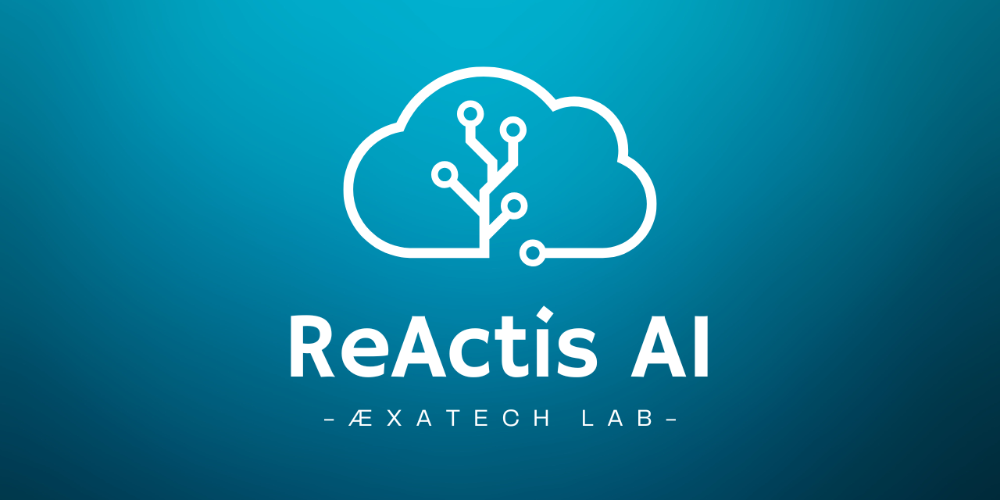

<div align="center" style="width: 100%;">
  
</div>
<h1 align="center">ReActis_AI</h1>
<p align="center">
  
  
  
  
</p>
<p align="center">
  <em>Developed with the software and tools below.</em>
</p>
<p align="center">
  
  
  
  
  
  
  
  
  
  
</p>

## Description 📑

This project is an AI-powered agent built with NestJS, designed to interact intelligently with users by leveraging real-time location data and weather information. It retrieves the user's exact location and fetches up-to-date weather details for their region, ensuring relevant and personalized responses. The application integrates with OpenAI's chatbot to process user input and generate thoughtful replies.

The project follows **Clean Code** principles to ensure readability, maintainability, and scalability. The architecture adheres to **Clean Architecture** by separating concerns into distinct modules, such as controllers, services, and use cases, promoting a clear structure and easier testability. **Dependency Injection** is used extensively to manage dependencies between components, improving flexibility and decoupling, making the codebase more modular and easier to maintain.

### Core Features ⚙️

- **JWT Authentication**: Protects sensitive routes and ensures that only authenticated users can access chatbot features.
- **OpenAI Chatbot Integration**: Processes user input and generates responses using OpenAI’s API.
- **Weather Information**: Retrieves weather data using an external weather service.
- **Location-Based Services**: Uses geolocation services to provide location-based information.
- **Modular Design**: The application follows a modular structure, separating domain logic, use cases, infrastructure, and guards.

## Project Structure 🏗️

Here’s an overview of the file structure in the project:

```
src
├── app.module.ts                       # Main application module
├── controllers                          # Handles incoming HTTP requests
│   ├── agent.controller.spec.ts         # Unit tests for agent controller
│   └── agent.controller.ts              # Controller for handling agent-related requests
├── domain                               # Defines business logic interfaces
│   └── interfaces
│       ├── chat-agent-service.interface.ts  # Interface for chatbot service
│       ├── location-service.interface.ts   # Interface for location service
│       └── weather-service.interface.ts    # Interface for weather service
├── guards                               # Authentication guards
│   ├── auth.guard.spec.ts               # Unit tests for auth guard
│   └── auth.guard.ts                    # Guard for handling JWT authentication
├── infrastructure                       # External services and APIs integration
│   └── services
│       ├── location.service.spec.ts     # Unit tests for location service
│       ├── location.service.ts          # Service for geolocation functionality
│       ├── openai-chat-agent.service.spec.ts # Unit tests for OpenAI service
│       ├── openai-chat-agent.service.ts  # Service for integrating with OpenAI
│       ├── weather.service.spec.ts      # Unit tests for weather service
│       └── weather.service.ts           # Service for interacting with weather APIs
├── main.ts                              # Application entry point
└── use-cases                            # Application use cases
    ├── process-user-input.use-case.spec.ts  # Unit tests for processing user input
    └── process-user-input.use-case.ts      # Use case for handling and processing user input
```

## Project Setup 🔧

To get started with the project, you can install the required dependencies:

```bash
npm install
```

## Compile and Run the Project 🏃🏻

To run the application, use the following commands based on the environment:

### Development Mode

```bash
npm run start
```

### Watch Mode (with auto-reload)

```bash
npm run start:dev
```

### Production Mode

```bash
npm run start:prod
```

## Run Tests 🧪

The project includes unit tests and e2e tests to ensure the correct functionality of the API.

### Unit Tests

```bash
npm run test
```

### Test Coverage

```bash
npm run test:cov
```

## Authentication (JWT) 🛡️

### Auth Guard

The application uses JWT tokens to secure its routes. A valid JWT token must be included in the `Authorization` header of the HTTP request as `Bearer <your-token>`.

- **Valid token example**:

  ```bash
  Authorization: Bearer <valid-jwt-token>
  ```

### Auth Flow

- **Without token**: The application will respond with a `401 Unauthorized` error and the message `Missing authentication token`.
- **Invalid token**: If the token is invalid, a `401 Unauthorized` error is returned with the message `Invalid authentication token`.

## Services and Use Cases 🚚

### OpenAI Chat Agent

The application integrates with OpenAI's API to provide responses to user input. The `OpenAIChatAgentService` handles communication with the OpenAI API.

### Weather Service

The weather data is fetched from an external API, allowing the user to retrieve information based on their location or query. The `WeatherService` is responsible for interacting with the weather API.

### Location Service

The location-based services are handled by the `LocationService`, which provides geolocation functionality based on user input or external data sources.

### Use Case: Processing User Input

The application processes user input using the `ProcessUserInputUseCase`. This use case coordinates the input processing, determining whether the user is asking about weather, location, or initiating a chatbot interaction.

## Deployment 🚀

For deployment, follow the official [NestJS Deployment Documentation](https://docs.nestjs.com/deployment).

You can also deploy the application to cloud platforms like AWS using the official [NestJS Mau](https://mau.nestjs.com) platform.

```bash
npm install -g mau
mau deploy
```

## Resources 📖

Here are a few helpful resources for developers working with NestJS:

- [NestJS Documentation](https://docs.nestjs.com) – Learn more about the framework.
- [Discord Channel](https://discord.gg/G7Qnnhy) – For questions and support.
- [Official Video Courses](https://courses.nestjs.com/) – Deep dive into NestJS concepts.
- [NestJS Devtools](https://devtools.nestjs.com) – Visualize and interact with your NestJS app.
- [Enterprise Support](https://enterprise.nestjs.com) – Get enterprise-grade support for your project.

## Stay in Touch 💬

- Author - [Romain Portanguen](https://www.linkedin.com/in/romain-portanguen/)
- Website - [https://romain-portanguen.netlify.app](https://romain-portanguen.netlify.app/)
- Gmail - [portanguenr@gmail.com](https://mail.google.com/mail/u/0/?fs=1&tf=cm&source=mailto&to=portanguenr@gmail.com)

## License 🪪

[MIT licensed](https://github.com/nestjs/nest/blob/master/LICENSE).
